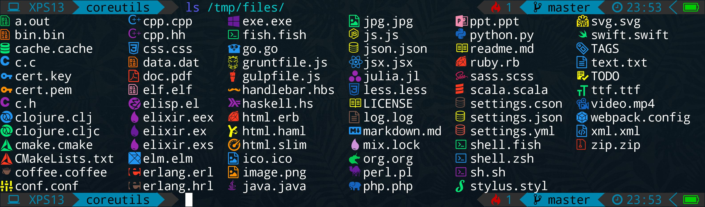

## Overview

This is a fork of [coreutils](https://github.com/coreutils/coreutils) with a modified ls that print icons  

## Dependencies

- clang
- [icons-in-terminal](https://github.com/sebastiencs/icons-in-terminal)  

## Installation

You need to install [icons-in-terminal](https://github.com/sebastiencs/icons-in-terminal) first.
- Once installed, you can run:
```bash
$ ./bootstrap
$ export CFLAGS=-DNO_TRUE_COLOURS=1 # Execute this line _only_ if your terminal doesn't support true colours
$ export CC=clang CXX=clang++
$ ./configure --prefix=/opt/coreutils
$ make
$ make install
$ /opt/coreutils/bin/ls
```
You can check if your terminal support true colours [here](https://gist.github.com/XVilka/8346728#now-supporting-truecolour).

## Customization

- You can change colors in `src/ls-icons.c`.
- To add new icons with file extensions, modify the array `file_matches` in `src/ls-icons.c`. Pull requests are welcome
